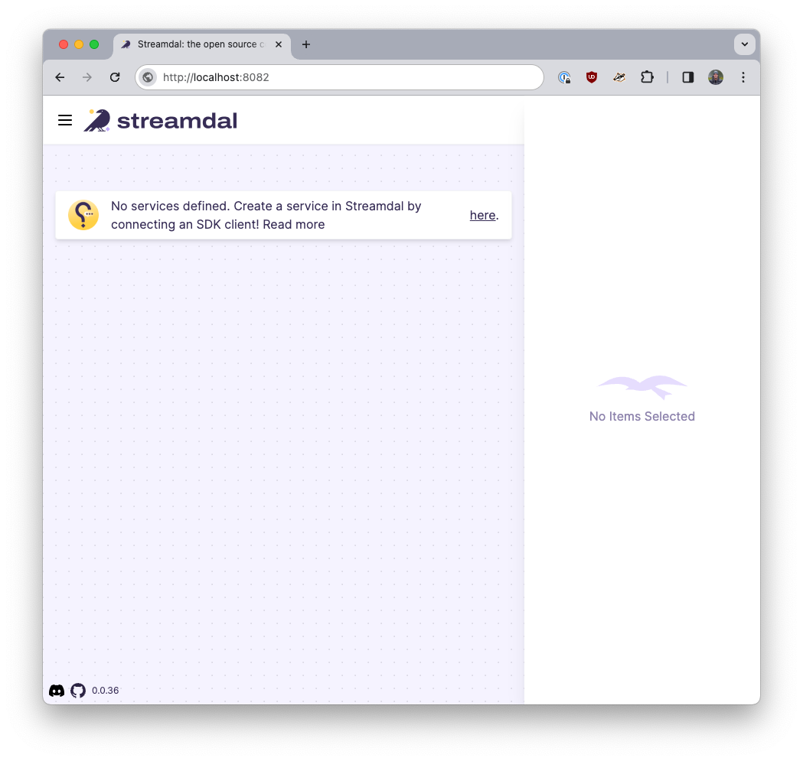
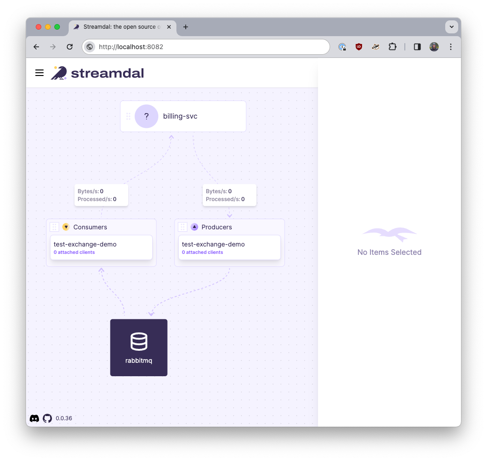
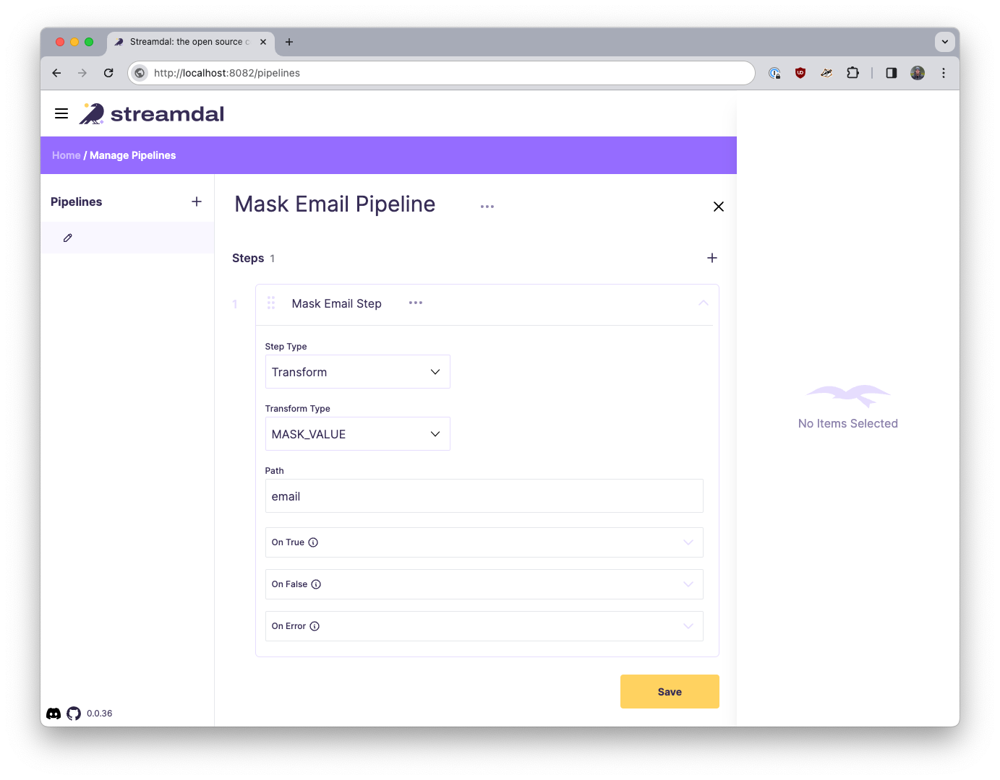

 Golang Client for RabbitMQ (instrumented with Streamdal)
=====================================================================================

This library has been instrumented with [Streamdal's Go SDK](https://github.com/streamdal/streamdal/tree/main/sdks/go).

## Getting Started

The following environment variables must be set before launching a producer or consumer:

1. `STREAMDAL_ADDRESS`
    - Address for the streamdal server (Example: `localhost:8082`)
1. `STREAMDAL_AUTH_TOKEN`
    - Authentication token used by the server (Example: `1234`)
1. `STREAMDAL_SERVICE_NAME`
    - How this application/service will be identified in Streamdal Console (Example: `rabbitmq`)

By default, the library will NOT have Streamdal instrumentation enabled; to enable it,
you will need to set the above environment variables and set `EnableStreamdal` to `true`

🎉 That's it - you're ready to run the example! 🎉

<sub>For more in-depth explanation of the changes and available settings, see [What's changed?](#whats-changed).</sub>

## Example

A fully working example is provided in [_examples/producer](_examples/producer/producer.go) and
[_examples/consumer](_examples/consumer/consumer.go).

To run the example:

1. Start a local RabbitMQ instance: `docker-compose -f _examples/docker-compose.yml up -d`
1. Install & start Streamdal: `curl -sSL https://sh.streamdal.com | sh`
1. Open a browser to verify you can see the streamdal UI at: `http://localhost:8080`
    - _It should look like this:_ 

1. Produce a message:

    ```bash
   STREAMDAL_ADDRESS=localhost:8082 \
   STREAMDAL_AUTH_TOKEN=1234 \
   STREAMDAL_SERVICE_NAME=billing-svc \
   go run _examples/producer/producer.go -body '{"name": "Demo Person", "email": "demo.p@streamdal.com"}' -key "demo"
    ```

1. Run a consume operation:

   ```bash
   STREAMDAL_ADDRESS=localhost:8082 \
   STREAMDAL_AUTH_TOKEN=1234 \
   STREAMDAL_SERVICE_NAME=billing-svc \
   go run _examples/consumer/consumer.go -key "demo"
    ```

1. Open the Streamdal Console in a browser [https://localhost:8080](https://localhost:8080)
    - _It should look like this:_ 
1. Create a pipeline that detects and masks PII fields & attach it to the consumer
    - 

1. In another terminal, produce a message again:

    ```bash
   STREAMDAL_ADDRESS=localhost:8082 \
   STREAMDAL_AUTH_TOKEN=1234 \
   STREAMDAL_SERVICE_NAME=billing-svc \
   go run _examples/producer/producer.go -body '{"name": "Demo Person", "email": "demo.p@streamdal.com"}' -key "demo"
    ```
   
1. Then run the consumer again, you should see a masked message in the consumer terminal:

    ```bash
   2024/03/01 10:13:05 [INFO] got 56B delivery: [1] "{\"name\": \"Demo Person\", \"email\": \"demo****************\"}"
    ```

## Passing "runtime" settings to the shim

By default, the shim will set the `ComponentName` to "rabbitmq" and the `OperationName`
to the name of the exchange you are producing to. For the consumer, the
`OperationName` will be set to the name of the `exchange+"-"+routing key`.

Also, by default, if the shim runs into any errors executing `streamdal.Process()`,
it will swallow the errors and return the original value.

When producing, you can set `StreamdalRuntimeConfig` in `PublishWithDeferredConfirmWithContext()`:

```go
res, err := channel.PublishWithDeferredConfirmWithContext(
   ctx,
   "events",
   "new-orders",
   true,
   false,
   amqp.Publishing{
      Headers:         amqp.Table{},
      ContentType:     "application/json",
      ContentEncoding: "",
      DeliveryMode:    amqp.Persistent,
      Priority:        0,
      AppId:           "sequential-producer",
      Body:            []byte(`{"email": "example@streamdal.com"}`)
   },
   amqp.StreamdalRuntimeConfig{
      OperationName: "custom-operation-name",
      ComponentName: "custom-component-name",
   },
)

// This will cause the producer to show up in Streamdal Console with the
// OperationName "custom-operation-name" and it will show as connected to
// "custom-component-name" (instead of the default "rabbitmq").
```

**Passing `StreamdalRuntimeConfig` in the consumer is not implemented yet!**

## What's changed?

The goal of any shim is to make minimally invasive changes so that the original
library remains backwards-compatible and does not present any "surprises" at
runtime.

The following changes have been made to the original library:

1. Added `EnableStreamdal` bool to the main `Config` struct
    - This is how you enable the Streamdal instrumentation in the library.
2. Added streamdal instance to `amqp.Channel`
3. Added `StreamdalRuntimeConfig` to `PublishWithDeferredConfirmWithContext()`
    - This is how you can pass runtime settings to the shim.
4A new file [./streamdal.go](./streamdal.go) has been added to the library that

   contains helper funcs, structs and vars used for simplifying Streamdal

   instrumentation in the core library.
5. Added shim code to `channel.Consume()' and `channel.PublishWithDeferredConfirmWithContext()`


